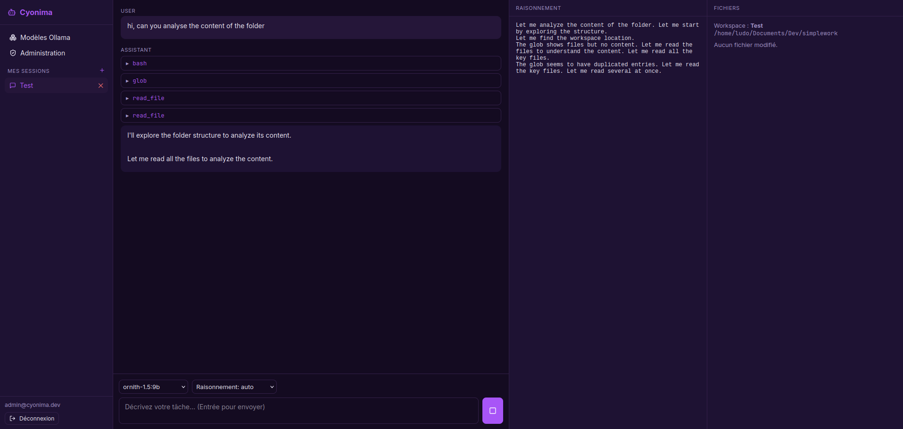

# Cyonima Code Agent — Server (WebApp entreprise)



Portail web **multiuser** d'agent IA de code, reprenant le concept de
[Cyonima-ia-code-agent](https://github.com/LudovicBoudi/Cyonima-code-agent)
(agent local mono-utilisateur) pour en faire une plateforme d'entreprise.

## Différences avec l'app desktop

| Aspect | Desktop (Tauri) | Serveur (Django) |
|---|---|---|
| Déploiement | Local, mono-utilisateur | Serveur, multi-tenant |
| Auth | Aucune | SSO (OIDC/SAML/LDAP) + email/mot de passe |
| Exécution | Sur la machine locale | Conteneurs Docker par workspace |
| Inférence | Ollama local | Ollama serveur partagé |
| Données | SQLite local | PostgreSQL |

## Stack

- **Backend** : Django 5.2 + DRF + Channels (WebSocket streaming) + Celery/Redis
- **Auth** : django-allauth (OIDC/SAML) + SimpleJWT
- **Inférence** : Ollama (HTTP partagé)
- **Sandbox** : Docker, un conteneur par workspace
- **Frontend** : React + Vite + TypeScript (UI violette reprise de l'app desktop)
- **Base de données** : PostgreSQL

## Structure

```
backend/            Application Django
  config/           settings (base/dev/prod), urls, asgi/wsgi, celery
  apps/
    accounts/       User custom + auth (JWT, allauth)
    organizations/  Organisations, équipes, membres, RBAC
    workspaces/     Workspaces, conteneurs sandbox, fichiers
    sessions/       Sessions d'agent + messages + WebSocket
    ollama/         Client Ollama (list/pull/delete/show)
    agents/         Boucle agent, outils, permissions, prompt
frontend/           SPA React (voir frontend/README.md)
sandbox/            Image Docker du sandbox d'exécution
```

## Fonctionnalités

- **Sessions d'agent en 3 colonnes** (chat / raisonnement / fichiers) avec
  auto-scroll : le défilement suit le bas tant que l'on n'a pas remonté pour
  lire, dans chacune des colonnes.
- **Catalogue de modèles** (page « Modèles Ollama ») : même sélection par défaut
  que l'app desktop, filtrable, avec statut installé et bouton
  d'installation (`ollama pull`).
- **Modèles à raisonnement** : relance automatique sans *thinking* si un tour ne
  produit que du raisonnement interne, message clair si la réponse reste vide.
- **Permissions par chemin** : lecture/écriture dans le workspace auto-approuvée,
  accès hors roots (ex. `/tmp`) soumis à approbation, `bash` systématiquement
  contrôlé.
- **Bouton arrêter** la génération en cours.

## Démarrage rapide (dev)

> En développement, aucun service externe n'est requis : le channel layer et le
> broker sont en mémoire par défaut (`USE_IN_MEMORY_CHANNEL`, réactivable avec
> `USE_IN_MEMORY_CHANNEL=0`), et on peut utiliser SQLite avec `USE_SQLITE=true`.

```bash
# 1. Backend
python3 -m venv .venv && source .venv/bin/activate
pip install -r backend/requirements-dev.txt
cd backend
python manage.py migrate
python manage.py createsuperuser
daphne -b 0.0.0.0 -p 8080 config.asgi:application   # API + WS sur :8080

# 2. Frontend (dans un autre terminal)
cd frontend && npm install && npm run dev            # SPA sur :5173

# 3. Ollama (optionnel, pour les pulls de modèles)
docker run -d -p 11434:11434 ollama/ollama:latest
```

L'application se visite sur **http://localhost:5173/** (Vite proxifie `/api`,
`/ws` et `/admin` vers le backend). Le port **8080** expose uniquement l'API.

### Workers Celery

`pull` de modèles et exécution des agents peuvent tourner dans des workers :

```bash
cd backend && celery -A config worker -l info          # tâches courtes
cd backend && celery -A config worker -Q agents -l info # exécution des agents
```

Sans worker (broker indisponible), le backend retombe sur une exécution
synchrone — pratique en dev.

## API (aperçu)

- `POST /api/auth/login/` → JWT (email + mot de passe) ; accès valable **12 h**,
  auto-renouvelé par le frontend via `POST /api/auth/refresh/` (refus de 401,
  refresh 7 jours).
- `GET  /api/auth/me/` → utilisateur courant
- `GET  /api/orgs/` → organisations de l'utilisateur
- `GET/POST /api/orgs/{org}/workspaces/` → workspaces
- `GET/POST /api/sessions/` → sessions d'agent
- `WS   /ws/sessions/{id}/?token=<jwt>` → streaming agent
- `GET  /api/ollama/models/` → modèles Ollama installés
- `GET  /api/ollama/catalog/` → **catalogue** de modèles recommandés (même
  sélection que l'app desktop : qwen3, ornith-1.5, gemma4, granite4.2…), avec
  statut *installé* et pull direct via `POST /api/ollama/models/{tag}/pull/`

## Déploiement multi-workers

L'état d'exécution des agents (verrou + annulation) est partagé via **Redis**
(`apps/agents/orchestrator.py`), donc plusieurs processus ASGI peuvent coopérer.
Pour scaler :

```bash
# Redis (obligatoire, pas de USE_IN_MEMORY_CHANNEL)
USE_IN_MEMORY_CHANNEL=false

# N processus ASGI (daphne) derrière un load-balancer
daphne -b 0.0.0.0 -p 8000 config.asgi:application
```

> En dev mono-process, on peut garder `USE_IN_MEMORY_CHANNEL=true` et
> `USE_SQLITE=true` (retombée automatique sans Redis).

## Tests

Suite pytest (avec `pytest-django`), utilisant SQLite + channel layer mémoire +
Celery eager (aucun service externe requis) :

```bash
cd backend && pytest          # ou : make test
```

La suite couvre l'auth, les organisations/RBAC, les workspaces, les sessions,
la boucle agent (tool calls, reprise, approbations), l'orchestration Redis
(via `fakeredis`), les tâches Celery et le client Ollama (mock HTTP).

## Release & déploiement

Un tag `v*` déclenche le workflow de release (`.github/workflows/release.yml`)
qui construit et publie trois images sur **GitHub Container Registry**
(`ghcr.io/<owner>/<repo>/<image>`), versionnées (`v1.2.3`, `1.2`, `latest`) :

- **`backend`** — Django + daphne (API REST + WebSocket), statiques via whitenoise ;
- **`frontend`** — nginx servant la SPA et proxy `/api` + `/ws` vers `backend` ;
- **`sandbox`** — image d'exécution jetable (un conteneur par workspace).

Référence de déploiement (remplacer `<image>` par vos images) :

```yaml
services:
  db:         { image: postgres:16-alpine }
  redis:      { image: redis:7-alpine }
  ollama:     { image: ollama/ollama:latest }
  backend:
    image: ghcr.io/<owner>/<repo>/backend:latest
    env_file: .env
    volumes: ["/var/run/docker.sock:/var/run/docker.sock", "./sandbox/workspaces:/sandbox/workspaces"]
  worker:
    image: ghcr.io/<owner>/<repo>/backend:latest
    command: celery -A config worker -l info
  agent-worker:
    image: ghcr.io/<owner>/<repo>/backend:latest
    command: celery -A config worker -Q agents -l info
  frontend:
    image: ghcr.io/<owner>/<repo>/frontend:latest
    ports: ["80:80"]
```

## Licence

MIT — voir [`LICENSE`](LICENSE).
